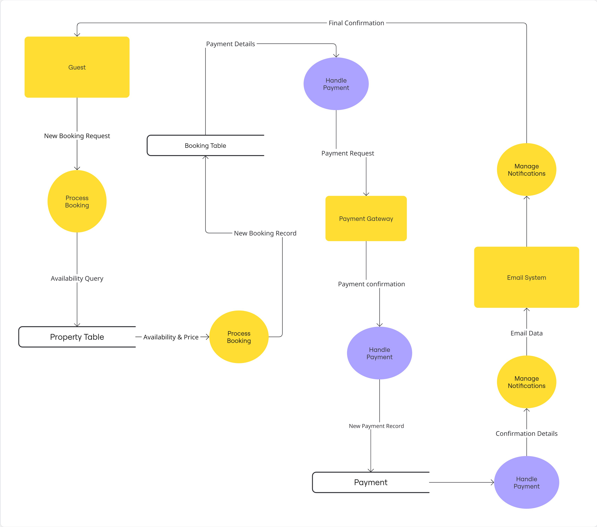

# AirBnB Clone: Data Flow Diagram (DFD)

This directory contains the DFD for the AirBnB backend system.

## 1. Objective
This DFD visualizes how data moves though the system. It maps the data inputs, the processes that transform the data, and the data stores where it rests. This is a Level 1 DFD, showing the main sub-processes of the backend.

The diagram is based on the Gane & Sarson notation.

## 2. DFD Legend
* **Squares:** External Entities (Actors)
* **Rounded Rectangles:** System Processes (API Functions)
* **Open-Ended Rectangles:**  Data Stores (Database Tables)
* **Labeled Arrows:** Data Flows (The data itself)

## 3. Data Flow Diagram
The diagram highlights the core data flows for user registration, property listing, and the booking process.
