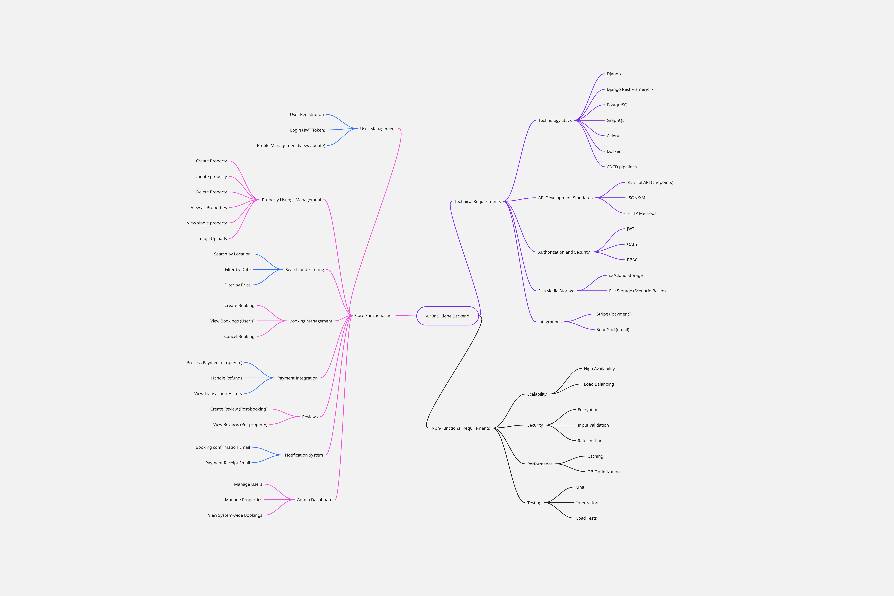

# Project Features and Functionalities
This directory contains the visual documentation for the Airbnb Clone backend project.

## 1. Objective
The purpose of this document is to provide a high-level visual overview of all features and functionalities that the backend system must support. This serves as a feature map for the develpment team to ensure all project requirements are accounted for.

## 2. Feature Map
The following diagram, created with Miro, breaks down the core functionalities and their respective sub-features.

### Core features include
* ***User Management***
* ***Property Listing management***
* ***Search and filtering***
* ***Bookign management***
* ***Payment integration***
* ***Reviews***
* ***Notification System***
* ***Admin Dashboard***