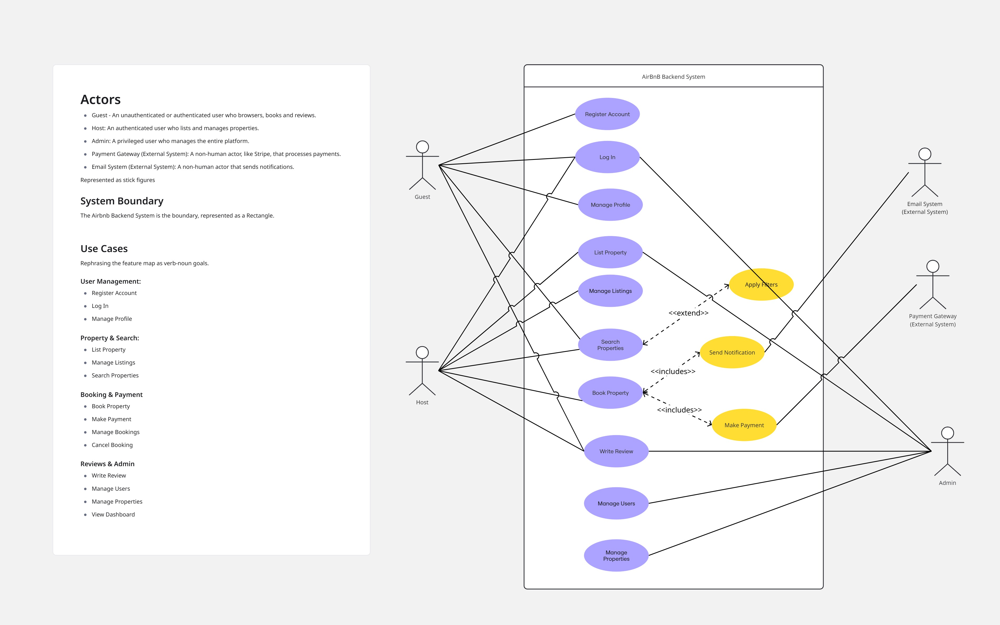

# AirBnB Use Case Diagram 
This directory contains the Use Case diagram meant to represent the feature map to provide a bit more detail of the application's features from the user's perspective.

## 1. Actors
 - Guest
 - Host
 - Admin
 - Payment Gateway (External System)
 - Email System (External System)

## 2. System Boundary
This is the AirBnB Backend System.

## 3. Use Cases
### User Management:
- Register Account
- Log In
- Manage Profile
### Property & Search:
- List Property
- Manage Listings
- Search Properties

### Booking & Payment:

- Book Property
- Make Payment 
- Manage Bookings
- Cancel Booking

### Reviews & Admin
- Write Review
- Manage Users
- Manage Properties
- View Dashboard